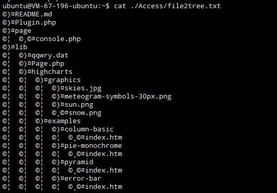

#file2tree
##功能
对一个文件夹进行遍历，生成如下图的文件树：

##注意
- 应当使用ansi编码
- 在linux命令行下cat 生成的文件时，可能存在编码导致文件树乱码问题

- 在用sublime编辑代码时，可能导致编码问题，最终导致生成的文件树文件存在中文和符号乱码
- 建议使用notepad++或者系统自带的notepad、leafpad等打开、编辑代码和文件树
- 在github上面显示出的符号存在乱码，请在本地使用notepad++打来，在格式中选择“以ANSI格式编码”